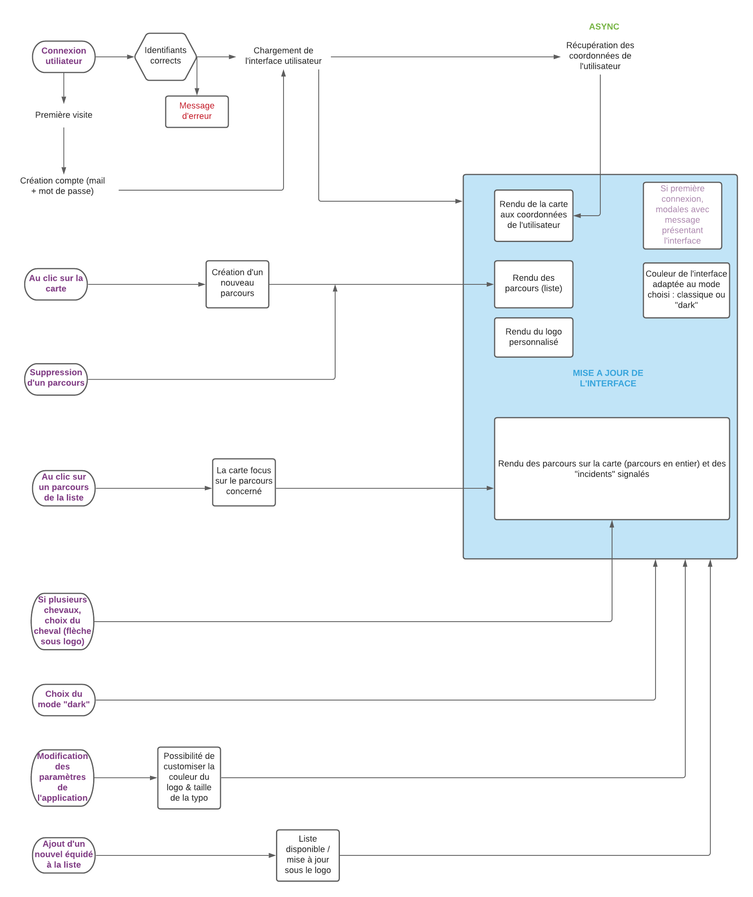
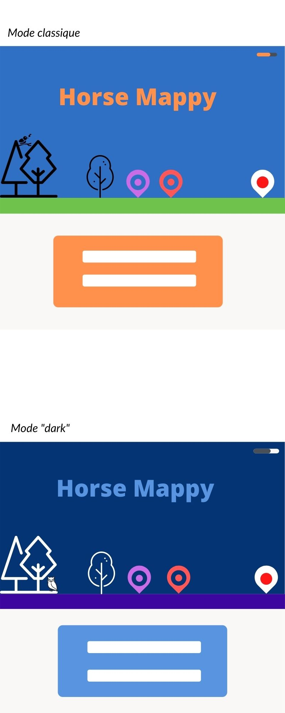
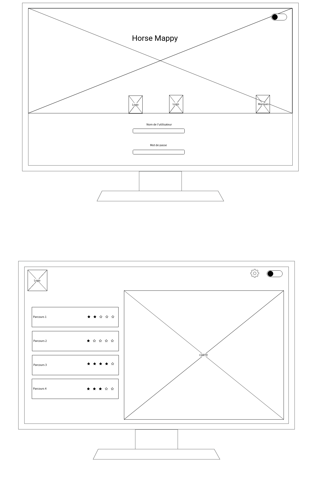
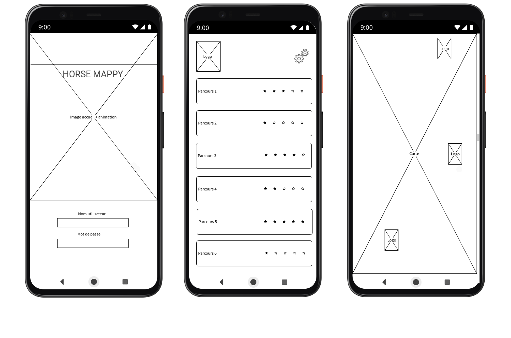

== Horse Mappy
*** 

=== Description de l'application
HorseMappy est une application permettant d'enregistrer différents parcours réalisés à l'extérieur avec votre cheval.
Cette application utilisera une partie front en ES6 (utilisation de la librairie LeafLet) et un back en Java Sping Boot.

=== Spécifications fonctionnelles
* L'utilisateur de cette application est un cavalier (propriétaire ou non) qui souhaite enregsitrer les parcours qu'il effectue lors de ses sorties en extérieur. +
 Il se connecte pour accéder à son espace personnel. S'il n'en a pas encore, il peut s'en créer un. +
 Cet espace lui permettra :
 ** D'avoir accès à la liste de ses équidés ainsi que la liste des parcours correspondant à chacun.
 ** Créer un nouveau parcours et l'enregistrer.
 ** Pouvoir leurs attribuer une note et les classer.
 ** L'utilisateur pourra personnaliser le logo de l'application.
 ** Il pourra voir et modifier ses identifiants mail et mot de passe.
 ** L'interface utilisateur tout comme celle pour la connexion sera disponible en mode "dark".
 ** Il pourra lister l'ensemble de ses équidés et pourra modifier cette liste. +

=== Organigramme de l'application

=== Design de l'application

* Typographies choisies : +
** Pour les titres : Nerko One (Google Fonts)
** Pour le contenu : Patrick Hand (Google Fonts)
** Couleurs utilisées : +
*** Mode classique : +
    - Bleu : #2F6FC4
    - Orange : #FF914D
    - Vert : #6FC24B
    - Fond gris : #FAF7F7
    - Blanc & Noir 

*** Mode "dark" : +
    - Bleu nuit : #043474
    - Bleu clair : #5994E1
    - Violet foncé : #3C069F
    - Fond gris : #FAF7F7
    - Blanc et Noir

=== Maquette de l'application desktop

=== Maquette de l'application mobile

